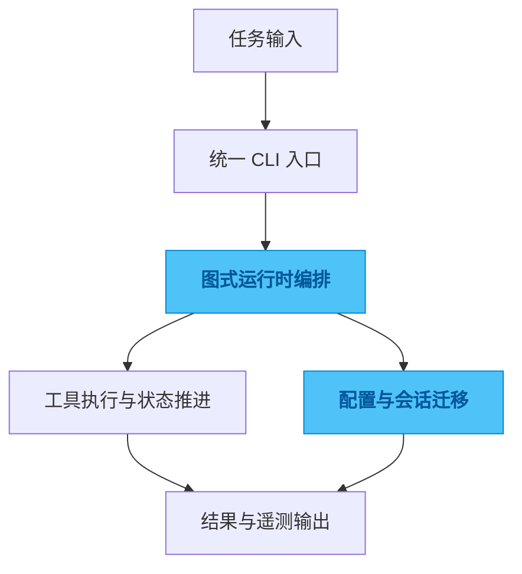

# agent-cli

## 一句话

一个面向代码任务的 Agent 运行时，用统一 CLI 把规划、执行、评估和配置迁移组织成可重复的工作流。

## 解决的问题

AI 编码工具一旦进入日常工作，真正的问题很快就不再是“能不能调模型”，而是任务怎么编排、配置怎么复用、运行怎么追踪、不同环境之间怎么平滑迁移。

## 为什么选这个方案方向

常见做法是把一堆脚本、命令参数和环境变量拼在一起，短期能跑，长期会越来越难复用和排查。我没有继续走这条路，而是把它做成有状态机、有配置层次、有运行时边界的 CLI 骨架，因为我更在意 workflow 的稳定性，而不是一次跑通。

## 我关注的效果 / 质量标准

我最在意的是运行过程可追踪、配置可以迁移、任务可以复现，以及在换仓库、换模型、换机器时，整体使用心智不要崩掉。

## 我想展示的工程判断

这个项目最能体现我的一个判断：AI 工具一旦进入真实工作流，关键竞争力不是“接了多少模型”，而是有没有把运行时、配置和状态边界设计清楚。

## 思路图

## 技术关键词

`Python` `LangGraph` `Typer` `agent runtime` `workflow` `telemetry`
