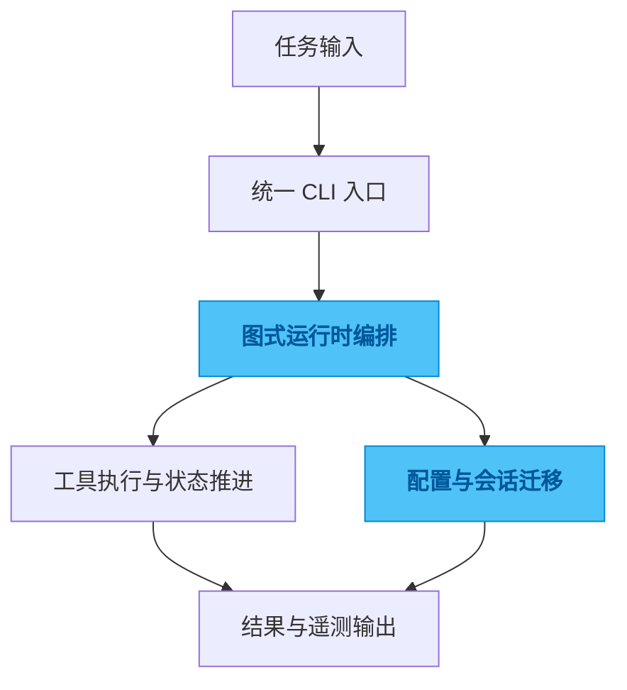

# agent-cli

## 一句话

一个把规划、执行、审查和运行配置收拢到同一入口里的 Agent CLI 运行时。

## 解决的问题

AI 编码真正进入日常工作后，麻烦很快就不再是“能不能调到模型”，而是另一类问题：任务怎么拆、结果怎么接续、失败怎么重跑、配置怎么迁移、换一个仓库以后整套使用方式会不会散掉。

很多工具在 demo 阶段都很好看，但一进真实工作流，现场就会变成一堆命令、参数、环境变量和临时约定。人还是得记住很多上下文，系统本身并没有真正接住复杂度。

## 为什么选这个方案方向

如果继续靠脚本和命令拼接，也能跑，但每多一个任务类型、一个模型入口、一次环境迁移，摩擦都会叠上去。问题不在于某条命令写得不够漂亮，而在于运行边界没有被明确表达出来。

所以我没有把它做成“再多几个命令”的工具，而是把它收敛成统一 CLI 入口，让规划、执行、状态推进和配置切换都落在同一个运行时框架里。先把工作流骨架立住，再谈模型、插件和扩展，整体会稳得多。

## 我关注的效果 / 质量标准

我更在意三件事：任务过程能不能追踪，配置能不能迁移，失败之后能不能低成本恢复。

一个可用的结果不是“这次跑通了”，而是换仓库、换机器、换模型时，用户的操作心智不会整个重来。工具应该帮人把流程收拢，而不是把复杂度换个地方藏起来。

## 我想展示的工程判断

这个项目最能体现我的一个判断：AI 工具一旦进入真实生产流程，核心竞争力就不再是“接了多少能力”，而是有没有把运行时、状态边界和迁移路径设计清楚。

我更关心的是把复杂度关进一个稳定边界里，而不是把功能不断往外堆。

## 思路图

## 技术关键词

`Python` `LangGraph` `Typer` `agent runtime` `workflow` `telemetry`
