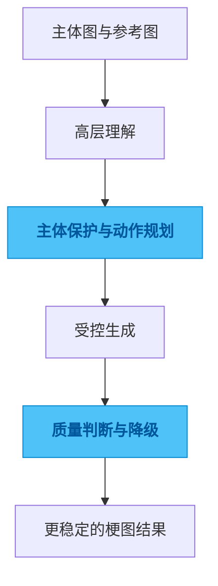

# animal-meme-generate

## 一句话

一个为动物拟人化梗图设计的生成流水线，重点解决主体保持、动作成立和风格控制。

## 解决的问题

这类图像任务最容易失败的地方，不是“生成不出来”，而是生成出来以后主体不再像原图、动作不可信、道具互动不成立，最后只有噱头，没有可用结果。

## 为什么选这个方案方向

常见做法是直接把几张图和一句 prompt 扔给通用模型，出图快，但一到复杂动作就不可控。我没有把希望全部押在端到端生成上，而是选择拆阶段处理，因为我更在意主体一致性和动作可控性，不接受只在 demo 图上偶尔成功。

## 我关注的效果 / 质量标准

我最关注的是主体识别度不能丢、动作必须读得清、失败时要有降级空间，以及生成质量要尽可能稳定，而不是靠反复抽卡。

## 我想展示的工程判断

这个项目体现的是我对生成式 AI 的一个稳定判断：复杂视觉任务不能只靠“更好的 prompt”，很多时候要先把问题拆成可控制的几个层次，再谈最终效果。

## 思路图

## 技术关键词

`Python` `image pipeline` `segmentation` `pose planning` `generation control`
