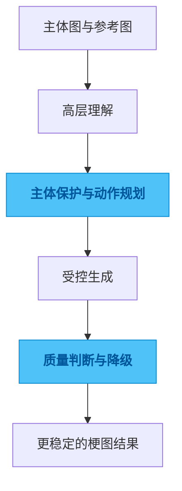

# animal-meme-generate

## 一句话

一个面向动物拟人化梗图的生成流水线，重点解决“像不像原来的主体”和“动作成不成立”。

## 解决的问题

这类图像任务最容易翻车的地方，不是出不了图，而是图出来以后已经不是那只猫、那只狗，或者动作看起来很别扭，道具关系也站不住。表面上像是“生成成功”，实际上并不能拿来用。

如果只是做几张偶尔成功的样张，这不是问题。但只要你想把结果稳定交付，主体识别度、动作可信度、风格收敛和失败兜底就都会冒出来。

## 为什么选这个方案方向

最省事的做法当然是把参考图和一句 prompt 直接交给通用模型，让它一次出结果。但这种方式越到复杂动作、复杂关系、复杂场景，越容易失控。问题不在于提示词不够长，而在于整个任务本身就不该被当成一个单步动作来赌。

所以我没有把希望压在单次端到端生成上，而是把问题拆成几个更容易控制的层次，先保证主体和动作这些底层约束，再去追求最后的表现力。这样做不是为了显得复杂，而是为了把成功从“抽卡”变成“可判断、可修正”。

## 我关注的效果 / 质量标准

我最在意的是三件事：第一，主体一眼还能认出来；第二，动作和交互是成立的；第三，失败时有明确的降级空间，而不是整张图直接报废。

对这类项目来说，质量不只是“够有趣”，还包括结果是不是稳定、是不是可控、是不是能持续产出，而不是偶尔撞出一张好图。

## 我想展示的工程判断

这个项目体现的是我对生成式视觉任务的一贯判断：越是看起来靠灵感的东西，越不能只靠 prompt 侥幸成功。先把约束拆清楚，结果才有机会稳定。

我更看重的是控制力，而不是一次性惊艳。

## 思路图

## 技术关键词

`Python` `image pipeline` `segmentation` `pose planning` `generation control`
