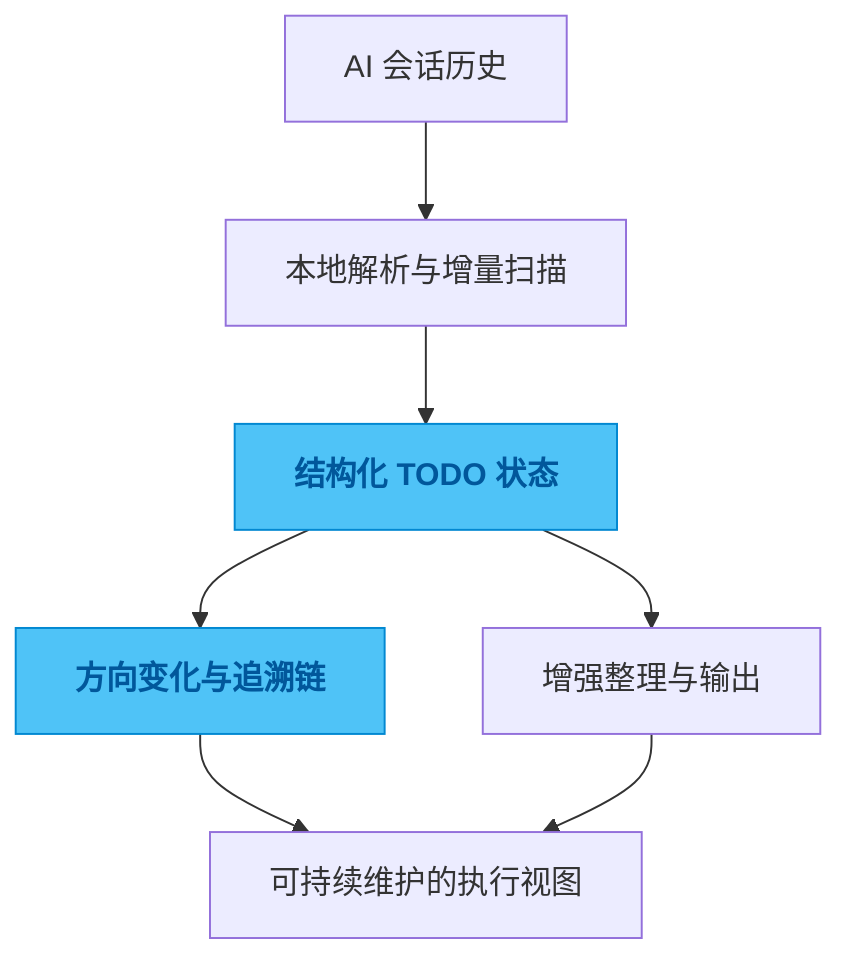

# cc-todo

## 一句话

一个把 AI 编码会话里的承诺、待办和方向变化提取出来并持续追踪的工具。

## 解决的问题

长时间的 AI 编码会话里，会不断出现“待会补上”“下一轮再改”“这里先留一个 TODO”这类承诺。真正麻烦的是，这些信息大多只存在于对话里，过一段时间以后，人只能记得“好像还有东西没做”，却说不清到底是什么。

如果没有结构化沉淀，任务并不是不存在，而是埋进了历史记录里。项目一多、回合一长，遗漏和误判几乎是必然的。

## 为什么选这个方案方向

最直接的做法是做关键词提取，或者每次重新让模型总结一遍。但前者抓不到状态变化，后者成本高，而且同一段历史换个时机总结，结果也可能完全不同。

所以我优先选择本地解析和增量扫描，把“发生过什么”先稳定抽出来，再把语言模型放在增强整理的位置，而不是放在唯一事实来源的位置。先让追踪成立，再去追求总结漂亮，这样整个系统更可信。

## 我关注的效果 / 质量标准

我最看重的是扫描能长期跑、结果能持续更新、同一个 TODO 的来龙去脉能被追出来。

一个真正有用的结果，不只是列出一串任务，而是回答得出：它从哪一轮出现，后来有没有被改口，为什么会留到现在。这种可追溯性，比“总结得像不像人写的”更重要。

## 我想展示的工程判断

这个项目最能体现我的一个偏好：与其做一个“更聪明的待办列表”，我更想把对话里那些会消失的意图、承诺和方向变化，保存成可持续维护的结构。

很多管理问题表面上是执行问题，往下看其实是上下文没有被保存下来。

## 思路图

## 技术关键词

`Go` `SQLite` `JSONL parsing` `todo extraction` `traceability`
