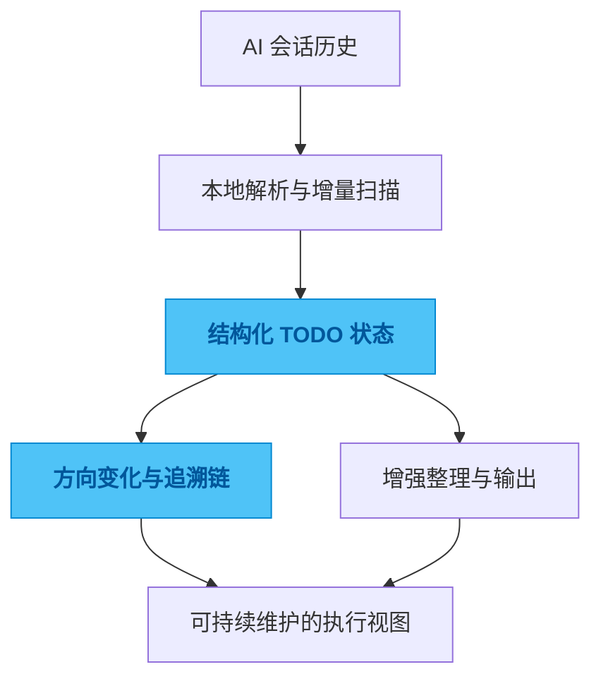

# cc-todo

## 一句话

一个从 Claude Code 和 Codex 会话历史中提取、整理并持续追踪 TODO 的工具。

## 解决的问题

AI 编码会话里有大量承诺、方向变更和未完成事项，但这些信息通常散落在历史记录里，难以检索，也无法沉淀成稳定的执行清单。

## 为什么选这个方案方向

常见做法是做关键词提取，或者每次靠模型重新总结一次，前者太浅，后者太贵也不稳定。我选择先做本地解析和增量扫描，再把 LLM 放在增强层，因为我更在意可追踪和可持续运行，而不是一次性的“总结效果”。

## 我关注的效果 / 质量标准

我最在意的是首次使用门槛低、扫描过程足够快、结果能持续更新，而且每个 TODO 最终都能回答一个问题：它为什么会变成现在这样。

## 我想展示的工程判断

这个项目最能体现我的一个偏好：比起做一个“更聪明的任务列表”，我更在意把对话里的意图、承诺和方向演化保存成可追溯的结构化资产。

## 思路图

## 技术关键词

`Go` `SQLite` `JSONL parsing` `todo extraction` `traceability`
