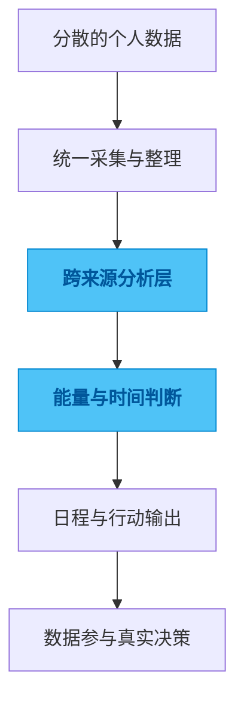

# daily-collection

## 一句话

一个把健康数据、时间数据和日程安排接起来的个人数据采集与分析系统。

## 解决的问题

个人数据最常见的问题不是没有记录，而是记录很多，却很难真正回答今天应该怎么安排。睡眠、活动、专注、日历、习惯，这些信息各自在不同地方，看起来都像有价值，放在一起却很难直接支持决策。

如果最后只能产出一些图表和统计，那数据只是被整理了，并没有真正参与行动。

## 为什么选这个方案方向

最容易做的路径是围绕单一来源写分析脚本，或者做一次性的可视化总结。它们都能快速出结果，但很难形成长期闭环，因为新的数据源、新的问题和新的输出方式一进来，整个结构就会变得越来越散。

所以我没有把它做成一堆分散脚本，而是保留一个主项目和多个能力模块，让采集、处理、分析和导出处在同一条连续链路上。这样真正重要的不是某个图表多漂亮，而是数据能不能稳定流到最终决策里。

## 我关注的效果 / 质量标准

我最关注的是原始数据边界要清楚，处理链路要能持续运行，输出要能真正影响时间安排和行动选择。

一个好的结果不是“看起来洞察很多”，而是到了要做决定的时候，系统确实能帮我判断今天适合做什么、不适合做什么。

## 我想展示的工程判断

这个项目体现的是我对个人数据系统的一种偏好：与其做很多漂亮分析，不如先把采集、清洗、反馈和行动闭环做稳。

只有当数据真的参与了决定，它才算进入系统，而不是停留在展示层。

## 思路图

## 技术关键词

`Python` `data pipeline` `personal analytics` `energy forecasting` `calendar sync`
