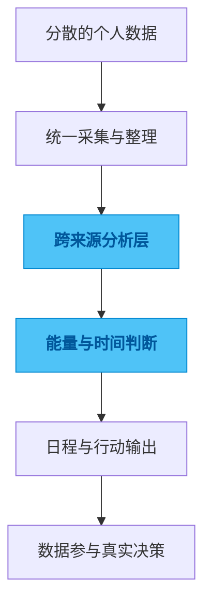

# daily-collection

## 一句话

一个把健康数据、时间数据和日程安排串起来的个人数据采集与分析系统。

## 解决的问题

个人数据通常分散在不同来源里，记录很多，但很难真正变成“今天什么时间适合做什么”的决策支持。

## 为什么选这个方案方向

常见做法是按单一数据源做分析脚本，或者只做一次性的可视化，看起来有产出，但很难长期积累。我没有把它做成零散脚本集合，而是保留一个主项目和多个子模块，因为我更在意长期演进和跨数据源整合能力。

## 我关注的效果 / 质量标准

我最关注的是原始数据和代码边界清楚、处理链路可以持续运行、输出能真正支持日常决策，而不是停留在“看起来有洞察”的图表层面。

## 我想展示的工程判断

这个项目体现的是我对个人数据系统的一种偏好：与其做很多漂亮的分析，不如先把采集、处理、导出和反馈闭环做稳，让数据真的参与行动选择。

## 思路图

## 技术关键词

`Python` `data pipeline` `personal analytics` `energy forecasting` `calendar sync`
