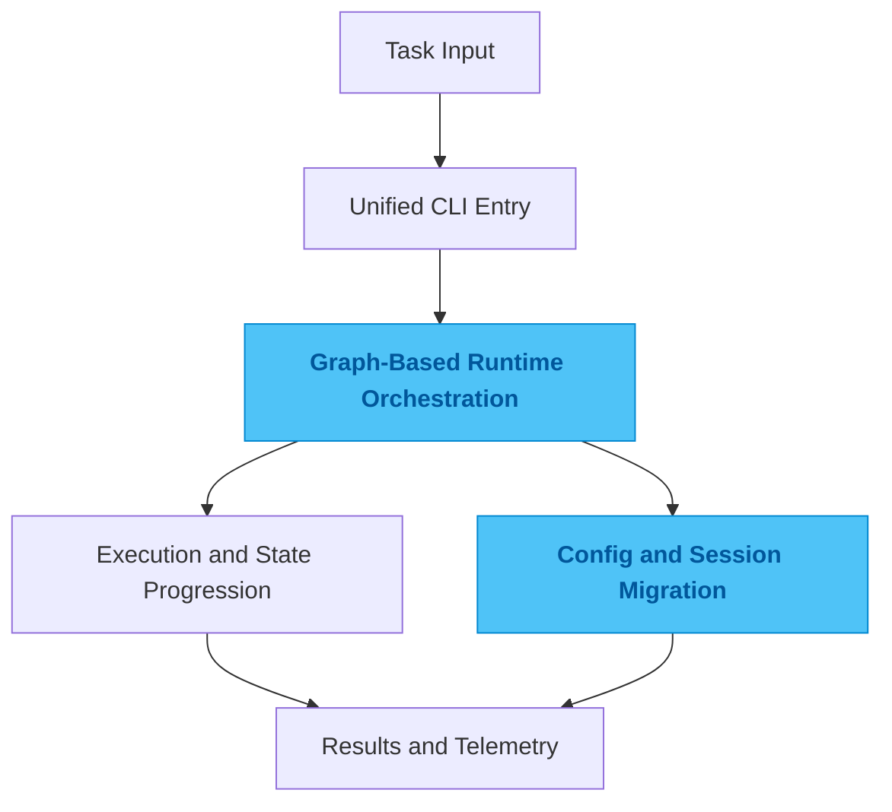

# agent-cli

## One-Line Summary

An agent CLI runtime that pulls planning, execution, review, and runtime configuration into one entry point.

## Problem

Once AI coding tools move from experiments into daily work, the hard part stops being model access. The real friction shows up elsewhere: how tasks are decomposed, how results flow into the next step, how failed runs recover, how configuration moves across environments, and whether the whole workflow falls apart when you switch repositories.

A lot of tools look great in a demo. Then they hit real work and turn into a pile of commands, flags, environment variables, and local conventions. People still have to carry the workflow in their heads. The system never really absorbs the complexity.

## Why This Direction

You can keep stacking scripts and commands and still get something that runs. But every new task type, model entry point, or runtime profile adds more drag. The issue is not that one command is ugly. The issue is that the runtime boundary was never made explicit.

So I did not treat this as "a few more commands." I treated it as a single CLI surface with a real execution model behind it. Planning, execution, state transitions, and configuration switching all sit inside the same frame. Once the workflow skeleton is solid, extension becomes much less fragile.

## Quality Bar / What I Care About

I care about three things most: whether runs are traceable, whether configuration moves cleanly, and whether failure recovery stays cheap.

A good result is not "it worked this time." A good result is that switching repositories, machines, or models does not force the user to relearn the whole operating model. The tool should compress workflow complexity, not relocate it.

## Engineering Judgment

This project shows a judgment I come back to often: once AI tools enter real production work, the advantage is no longer how many capabilities you can bolt on. It is whether runtime boundaries, state boundaries, and migration paths are clear.

I care more about containing complexity inside a stable frame than continuously expanding the surface area.

## Idea Sketch

## Technical Keywords

`Python` `LangGraph` `Typer` `agent runtime` `workflow` `telemetry`
