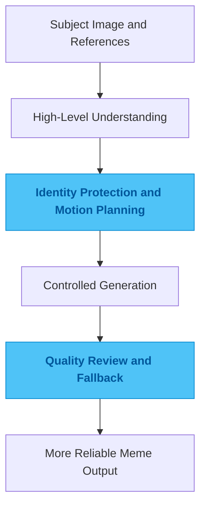

# animal-meme-generate

## One-Line Summary

A generation pipeline for anthropomorphic animal memes, focused on keeping the subject recognizable and the action believable.

## Problem

The hardest failure mode in this kind of image work is not "the model cannot generate an image." It is that the image stops looking like the original cat or dog, the pose feels wrong, or the prop interaction does not hold together. On paper the generation succeeded. In practice the image is unusable.

That is easy to ignore if you only need a few lucky examples. The moment you want stable output, though, subject identity, action credibility, style control, and graceful fallback all become first-order problems.

## Why This Direction

The easiest route is to hand a reference image and a prompt to a general model and let it produce a final result in one shot. That works until the scene gets more complex. Then control disappears. The problem is not that the prompt is too short. The problem is that the task itself should not be treated like a single gamble.

So I did not bet on one end-to-end generation step. I broke the problem into layers that are easier to control, secured the identity and motion constraints first, and only then pushed on style and final presentation. That shift turns success from luck into something you can evaluate and correct.

## Quality Bar / What I Care About

I care about three things most: the subject should still be immediately recognizable, the action should read cleanly, and failure should have a clear downgrade path instead of wasting the whole image.

For a project like this, "funny enough" is not a serious quality bar. Stability, controllability, and repeatability matter more than occasionally hitting a great sample.

## Engineering Judgment

This project reflects a view I keep returning to in generative visual work: the more creative the task looks, the less you can rely on prompt luck alone. Clear constraints come first. Stable results follow from that.

I care more about control than one-off spectacle.

## Idea Sketch

## Technical Keywords

`Python` `image pipeline` `segmentation` `pose planning` `generation control`
