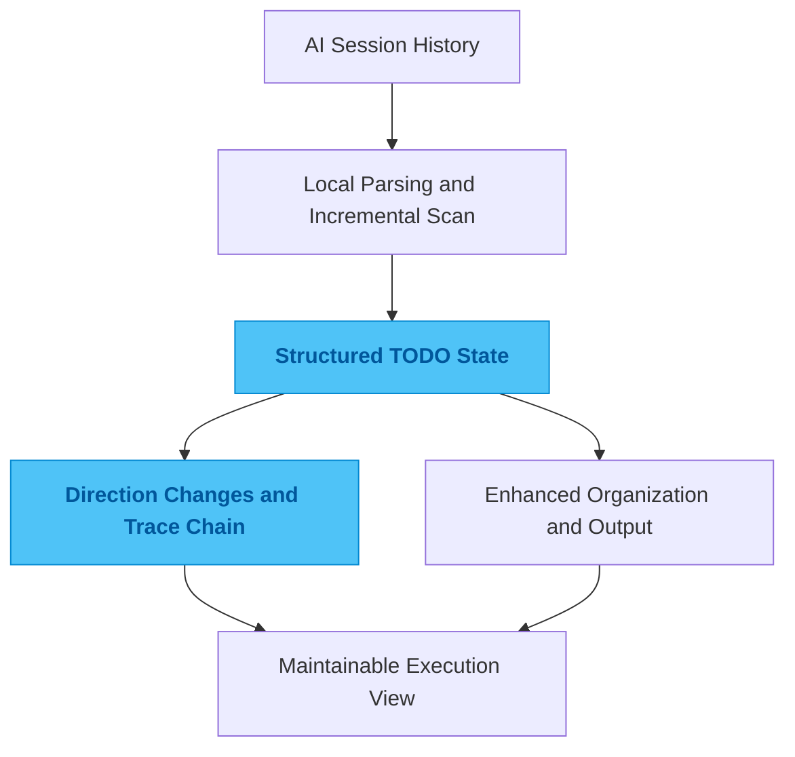

# cc-todo

## One-Line Summary

A tool that extracts commitments, TODOs, and direction changes from AI coding sessions and keeps tracking them over time.

## Problem

Long AI coding sessions are full of promises like "I'll fix that next," "leave a TODO here," or "we should come back to this." The problem is that most of those promises live only in the conversation. A while later, you are left with a vague sense that something is still unfinished, but no clean answer to what it was.

Without structure, tasks do not disappear. They just sink into history. Once the number of sessions and rounds grows, omissions and false assumptions become almost inevitable.

## Why This Direction

The obvious approach is keyword extraction, or asking a model to summarize the history again every time. The first option misses state changes. The second is expensive, and the output shifts depending on when you ask.

So I started with local parsing and incremental scanning. The first job is to stabilize what actually happened. Language models can help with organization later, but they should not be the only source of truth. Traceability has to exist before elegance matters.

## Quality Bar / What I Care About

I care most about whether the scan can run over time, whether the result can keep updating, and whether the full arc of a TODO can be reconstructed.

A useful output is not just a list of tasks. It should answer where an item first appeared, whether the intent changed later, and why it is still unresolved. That kind of traceability matters more than whether the summary sounds polished.

## Engineering Judgment

This project reflects a preference I have in general: instead of building a "smarter task list," I would rather preserve the intentions, promises, and direction changes that would otherwise disappear from the conversation.

Many execution problems are really context retention problems once you look closely.

## Idea Sketch

## Technical Keywords

`Go` `SQLite` `JSONL parsing` `todo extraction` `traceability`
