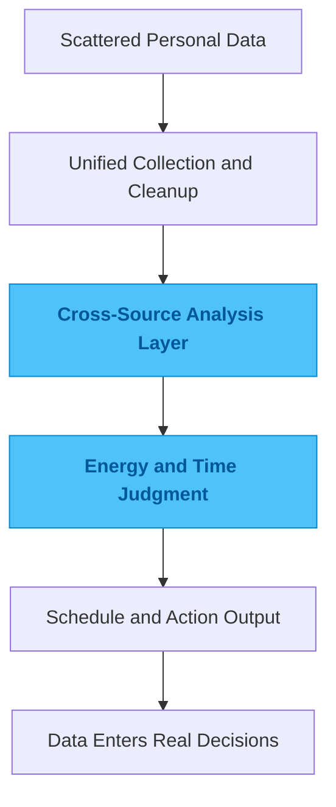

# daily-collection

## One-Line Summary

A personal data system that connects health signals, time signals, and scheduling decisions.

## Problem

The usual problem with personal data is not a lack of tracking. It is that plenty of data gets collected, yet very little of it can answer the question that actually matters today: what should I do with my time?

Sleep, activity, focus, calendar state, and habits all live in different places. Each source looks valuable on its own. Put together, they still do not naturally produce a decision. If the end result is only charts and statistics, then the data has been organized, but it has not entered action.

## Why This Direction

The easiest route is to write one-off analysis scripts around single sources or generate occasional visual summaries. Both approaches produce output quickly. Neither tends to form a durable loop once more data sources, more questions, and more outputs are introduced.

So I did not build a loose bundle of scripts. I kept a main project with multiple capability modules and treated collection, processing, analysis, and export as one continuous chain. The important question is not whether a chart looks good. It is whether data can reliably flow into a real decision.

## Quality Bar / What I Care About

I care most about clear boundaries around raw data, a processing path that can keep running, and outputs that meaningfully influence scheduling and action choices.

A good result is not "the insights look interesting." A good result is that when a real decision needs to be made, the system can help answer what fits today and what does not.

## Engineering Judgment

This project reflects a preference I have in personal data work: I would rather make the collection, cleaning, feedback, and action loop stable than produce a long list of attractive analyses.

Data only becomes part of the system when it starts shaping decisions instead of sitting at the presentation layer.

## Idea Sketch

## Technical Keywords

`Python` `data pipeline` `personal analytics` `energy forecasting` `calendar sync`
