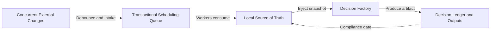

# notion-composer

## One-Line Summary

A local orchestration system built around a Notion task database, designed to absorb scattered automation into a single scheduling boundary.

## Problem

As rules accumulate in a task system, complexity rarely grows in a clean line. Date logic ends up in formulas. Recalculation lives in external scripts. Smart completion or scheduling sits in yet another automation flow.

The real pain in that kind of setup is not one wrong rule. It is state friction and tracing failure. Once multiple clients are modifying the same task state, and once no single layer owns the ordering of changes, the system starts to lose coherence. When a schedule shifts unexpectedly, you can no longer answer a simple question: which logic changed what, and when?

Without a single source of truth and a proper decision trail, every extra automation node makes the system harder to trust.

## Why This Direction

The intuitive response is to keep adding patch scripts around the edges. That solves local problems while accelerating system decay. I took the opposite path and reworked the foundation around two strict layers.

The first layer is a data scheduling plane. External changes are intercepted, converted into a transactional sequence of events, queued actions, and controlled workers. Task snapshots land locally first so the system has a clear factual base before anything more complex happens.

The second layer is a decision plane. Smarter scheduling and workback logic are not allowed to write directly into the base state. They operate on snapshots, evaluate options inside a constrained environment, and produce explicit decision artifacts with reasoning attached. The system accepts the artifact, not the hidden chain of thought.

## Quality Bar / What I Care About

I care most about explainability and degradation resistance.

Every scheduling decision should be auditable. The system should be able to answer why a path was chosen, why an alternative was rejected, and where execution stops if evidence is weak or output fails validation. I would rather reject an update and leave a reviewable log than allow a silent bad write.

## Engineering Judgment

This project shows how I think about system defense under growing complexity: instead of adding "smarter" nodes forever, I would rather build a hard control boundary above the data base.

As scheduling logic gets more complex, control should move upward, not disappear. Once contracts, stop-loss rules, and rollback expectations are fixed at the control layer, even uncertain automation can operate without taking away the maintainer's ability to reason about the system.

## Idea Sketch

## Technical Keywords

`Node.js` `event-driven` `task orchestration` `decision ledger` `fail-closed`
