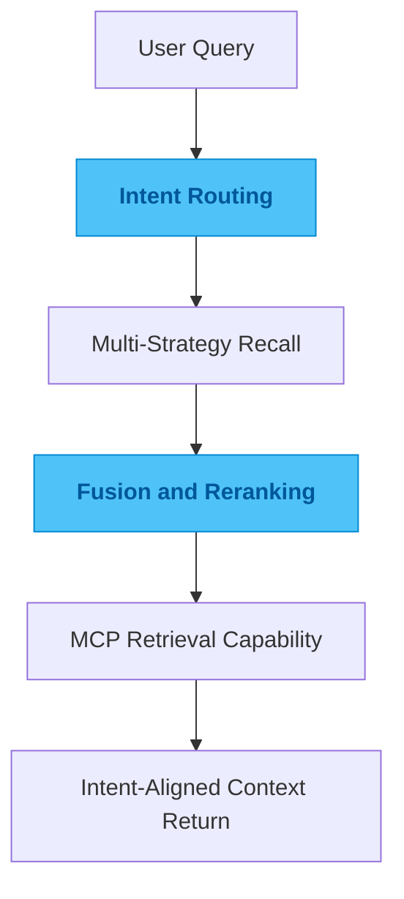

# spec-cloud

## One-Line Summary

An MCP retrieval service that turns long conversation history into a searchable capability, with emphasis on retrieving context by intent.

## Problem

As conversation history grows, the first thing that usually breaks is not the model. It is the way history gets retrieved. Keyword search can find literal overlap without finding the judgment that actually matters. Feeding the whole history back into context is expensive, slow, and noisy.

What you need is not "more history on screen." You need the useful part back at lower cost.

## Why This Direction

Keyword-only retrieval is too shallow. Vector-only retrieval can lose control on long-tail queries. The issue is not that one retrieval method is more advanced than the other. The issue is that a single path struggles to balance cost, precision, and workflow fit at the same time.

So I did not anchor the system to one retrieval strategy. I treated recall, fusion, and reranking as different layers of the same problem. First make retrieval broad enough to find candidates. Then make it disciplined enough to surface the right ones. That is more useful than chasing a label.

## Quality Bar / What I Care About

I care most about whether results actually align with user intent, whether cost stays under control, and whether the capability fits into existing workflows without extra ceremony.

A good retrieval system should not force users to read a long wall of history and do the ranking themselves. It should bring the valuable context close to the top.

## Engineering Judgment

This project reflects a judgment I have about retrieval systems: the value is not that search exists. The value is whether the returned context earns trust across quality, cost, and usability at the same time.

Retrieval should reduce decision load, not advertise the stack behind it.

## Idea Sketch

## Technical Keywords

`TypeScript` `MCP` `RAG` `semantic search` `reranking`
