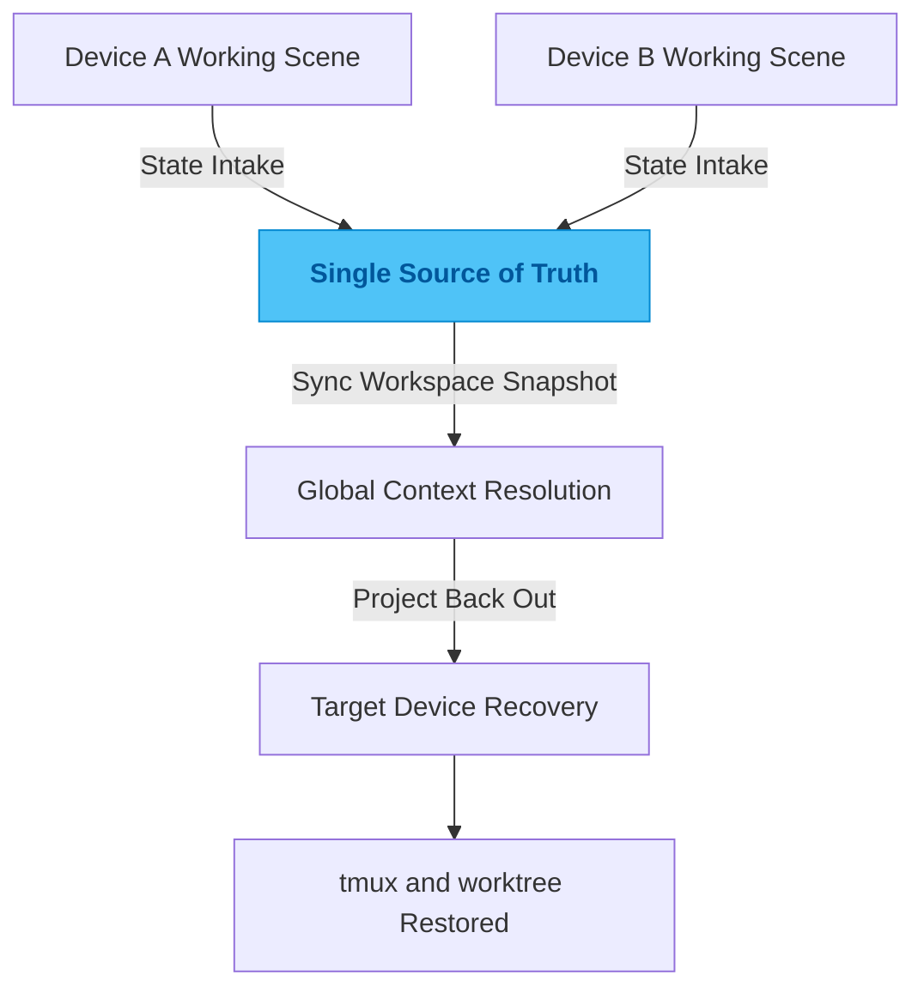

# tmux-sync

## One-Line Summary

A workspace manager built around `tmux`, `git worktree`, and a single source of truth for cross-device recovery.

## Problem

When development moves across machines, the thing you lose first is usually not code. It is the working scene itself.

Which workspace was I in yesterday? Which window still had the service running? Which branch did this whole terminal layout belong to? Those fragments live in different corners of the system. Rebuilding them on another device burns attention fast. A lot of what feels like "poor productivity" is really expensive context recovery caused by the lack of one global state source.

## Why This Direction

You can keep order through shell habits, tmux naming rules, and disciplined worktree usage for a while. On a single machine that may be enough. Across devices it eventually breaks down. As the number of machines and parallel workspaces grows, the recovery cost falls back on the user every time.

So I did not build another command-level convenience layer. I borrowed the idea of a single source of truth and treated workspaces, Git worktrees, and tmux sessions as structured snapshots instead of scattered local facts. In other words, the live working scene becomes a projection of managed state rather than a one-off condition tied to a physical machine.

## Quality Bar / What I Care About

I care most about deterministic recovery and low recovery cost.

A strong result means that switching devices does not break the development thread. With a small set of commands, the user should be able to recreate the exact working context on another machine without rebuilding the mental model by hand.

## Engineering Judgment

This project captures an engineering preference I return to often: many apparent productivity problems are really distributed state problems.

The key move is turning messy environment habits into synchronized state snapshots. Once the system owns the interpretation of state, the tool starts compounding value. Cross-device context transfer becomes natural instead of depending on memory and discipline.

## Idea Sketch

## Technical Keywords

`tmux` `git worktree` `SSOT` `cross-device flow` `state snapshots` `workspace recovery`
