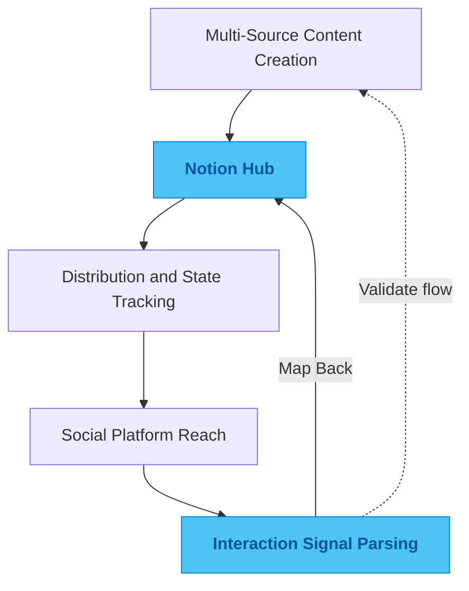

# tweet-database

## One-Line Summary

A Notion-centered content system that tracks multi-source creation and maps social interaction signals back into the source record.

## Problem

If Notion is only used as a writing board, content quickly drifts away from the interaction it creates on external platforms. The difficult part is not sending a post out. It is capturing what happens after distribution in a structured way.

Without that feedback loop, it becomes very hard to test the relationship between content creation and downstream attention, or to understand how a piece of content moved through different circles over time.

## Why This Direction

The simplest setup is one-way publishing plus a dashboard. That separates the origin of the content from the social signals that follow it.

My view was that both sides have to live in the same boundary. Source content should be maintained in one place, and external interaction signals should be mapped back into that same record. If interaction is just another form of state change, then content, routing, and feedback belong in one controllable system instead of scattered across multiple tools.

## Quality Bar / What I Care About

I care most about long-term signal quality: whether the cross-platform state model stays clear, whether returned interaction signals attach to the right source, and whether different content flows stay separated from one another.

A good system should not only show numbers. Weeks later, it should still be possible to reconstruct how a piece of content moved, what kind of resonance it created, and how that should shape the next round of interaction.

## Engineering Judgment

The valuable part of automation is not only sending data out. It is bringing the result back and preserving the relationship. This project reflects how I think about content lifecycles: social feedback is messy and asynchronous, but it can still be reduced into structured state inside a controllable record.

That shift lets engineering discipline take over where platform feedback is otherwise fuzzy.

## Idea Sketch

## Technical Keywords

`TypeScript` `Notion API` `social signal parsing` `content workflow` `data synchronization` `state machine`
