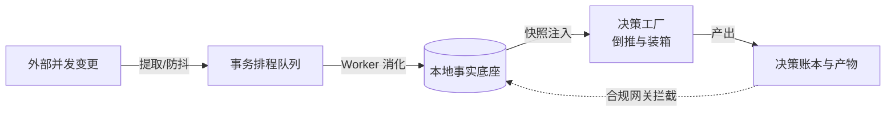

# notion-composer

## 一句话

一个基于 Notion 任务库的本地编排系统，用“事件排程总线 + 决策工厂”的架构，收编原本散落在各处的自动化脚本。

## 解决的问题

当任务系统的规则变多，复杂度通常会以不可控的方式散开：日期联动在数据库公式里，重算逻辑在外部脚本里，智能补全又在另一个自动化流程中。

这种“散装自动化”最大的痛点不在于某条规则写错了，而在于状态摩擦和追溯灾难。多端并发修改时，如果没有统一的排程控制，系统就会陷入状态竞争；一旦出现预期外的日程重排，根本查不清“那一秒到底是谁按什么逻辑改了数据”。当系统失去了唯一事实源（SSOT）和决策账本，每加一个新节点都像在碰运气，维护成本成倍增长。

## 为什么选这个方案方向

最直觉的做法是继续在外围写补丁脚本，但这只会让系统加速劣化。为了彻底解决时序混乱和状态黑盒的问题，我选择重构底层设计，把系统划分为严格的两层：

首先是建立“数据排程层（Data Plane）”。我放弃了传统的定时同步，把所有外部变更拦截下来，统一转为“变更 -> 事件 -> 动作队列 -> Worker”的连续事务排程链。所有任务快照必须先落入本地 SQLite 形成绝对的事实底座，靠事件防抖、队列合并和失败重试来消化混乱的并发变更，保证核心状态收敛。

其次是引入“决策工厂（Decision Factory）”。所有的智能调度、时间容量倒推（Workback），都不能再直接去修改底层数据。它们必须先读取数据快照，在沙盒里进行打分和装箱，最后生成一份带有推导理由的“决策产物（Artifacts）”。系统只认产物，不认中间的黑盒逻辑。

## 我关注的效果 / 质量标准

我最在意的是系统是否具备“可解释性”与面对脏数据的“防劣化能力”。

任何一次排程调度，都必须能在决策账本（Ledger）里回答：“为什么选这个方案？为什么拒绝了备选？如果执行失败在哪里止损？”。只要外部提供的证据不足或大模型的输出格式不匹配，系统必须严格执行 Fail-closed（安全拒绝），宁可留下待审计的防错日志，也绝不允许静默的错误写回。

## 我想展示的工程判断

这个项目体现了我在面对系统失控时的工程防御意识：与其不断追加“更聪明”的大模型节点，不如先在数据底座上方建立一层坚固的防火墙。

当排程逻辑越来越复杂，控制权反而应该上移。通过把边界约束、止损策略和回滚机制提前固定在“高层控制（Control Plane）”中，让所有的智能推断都在明确的契约下交卷。只要有了合规网关和审计账本，哪怕引入再多不确定的复杂自动化，维护者也能在不断膨胀的系统中保持绝对的掌控感。

## 技术关键词

`Node.js` `Event-Driven` `Task Orchestration` `Decision Ledger` `Fail-closed`

## 思路图

