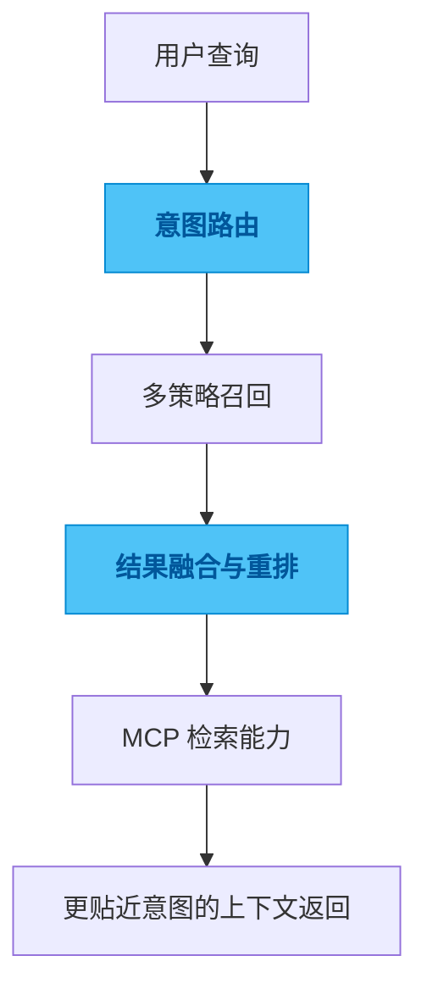

# spec-cloud

## 一句话

一个面向会话历史检索的 MCP 服务，把长对话做成可检索的 RAG 能力。

## 解决的问题

当会话历史足够长之后，传统关键词搜索很难支撑“按意图回忆上下文”的需求，而把整段历史重新喂给模型又太贵、太慢、也太噪。

## 为什么选这个方案方向

常见做法是只做向量检索，或者只做关键词搜索，两边都能工作，但都不够稳。我没有押宝单一检索方式，而是把召回、融合和重排拉开处理，因为我更在意检索质量和 token 效率，而不是技术标签本身。

## 我关注的效果 / 质量标准

我最关注的是搜索结果是否真的更接近用户意图、成本是否可控、工作流接入是否顺滑，以及用户是否能在不看长历史的情况下快速找回真正有用的上下文。

## 我想展示的工程判断

这个项目体现的是我对检索系统的一种判断：真正有价值的不是“有搜索”，而是搜索结果能不能在成本和质量之间保持一个值得信任的平衡。

## 思路图

## 技术关键词

`TypeScript` `MCP` `RAG` `semantic search` `reranking`
