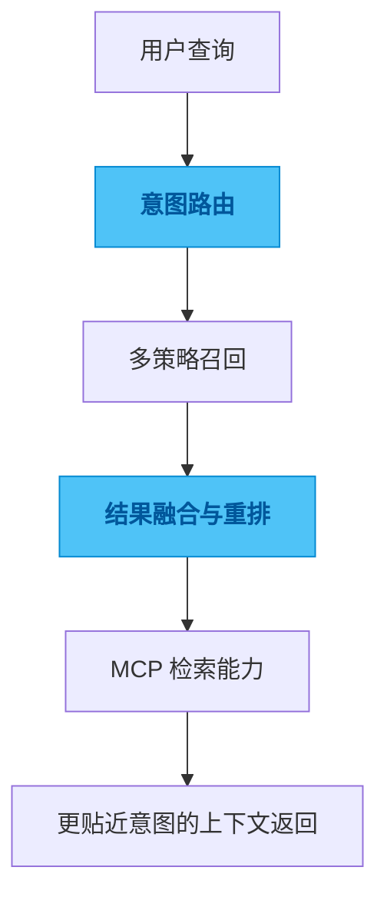

# spec-cloud

## 一句话

一个把长会话历史做成可检索能力的 MCP 服务，重点解决“按意图找回上下文”。

## 解决的问题

会话一长，最先失效的通常不是模型，而是找历史的方法。关键词搜索能找到字面相近的片段，却未必能找回真正相关的判断；把整段历史重新塞回上下文又太贵、太慢，也会把噪音一起带回来。

真正需要的不是“看见更多历史”，而是用更低成本找回真正有用的那一段。

## 为什么选这个方案方向

如果只做关键词搜索，召回会太浅；如果只做向量检索，又容易在长尾查询里失去可控性。问题不是某种检索技术不够先进，而是单一路径很难同时兼顾成本、精度和接入体验。

所以我没有押在单一检索方式上，而是把召回、融合和重排看成不同层次的问题分别处理。先让“找得到”成立，再让“找得准”逐步收敛，这比直接追求某个技术标签更务实。

## 我关注的效果 / 质量标准

我最关注的是结果是否真的更贴近用户意图，成本是否可控，接入工作流时是否足够自然。

一个好的检索系统，不该要求用户自己阅读一长串历史再做判断，而是应该先把真正值得看的内容缩到前面。

## 我想展示的工程判断

这个项目体现的是我对检索系统的一种判断：真正有价值的不是“有搜索”，而是搜索结果能不能在质量、成本和可信度之间保持平衡。

检索不是展示技术栈，而是替用户减少判断负担。

## 思路图

## 技术关键词

`TypeScript` `MCP` `RAG` `semantic search` `reranking`
