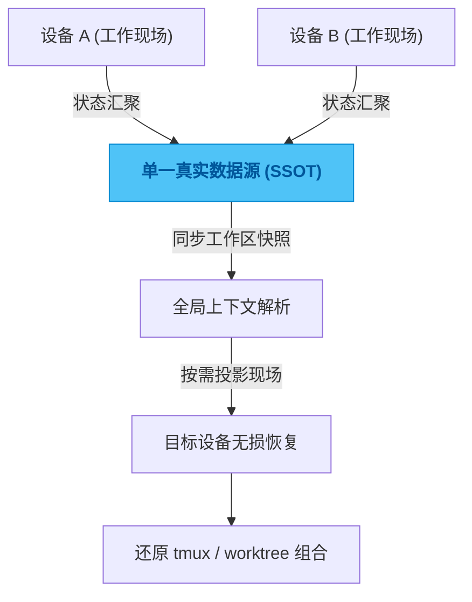

# tmux-sync

## 一句话

基于单一真实数据源（SSOT）理念，统管 `tmux` 会话与 `git worktree`，实现跨设备工作区无缝恢复的工作台管理器。

## 解决的问题

跨机器切换开发环境时，最容易丢的往往不是代码，而是“现场”。

昨天停在哪个工作区？哪个窗口还挂着服务进程？当前这一组终端到底对应哪个特定的需求分支？这些信息分散在操作系统的不同角落里。一旦要在另一台设备上重构这些上下文，注意力会被迅速消耗。很多“效率低”的感受，往下拆其实不是操作慢，而是缺乏一个全局的“源”来串联这些随时生灭的现场状态，导致每次跨设备流转都要人肉重建心智模型。

## 为什么选这个方案方向

继续靠 shell 习惯、tmux 命名规范和严苛的 worktree 纪律去维持秩序，在单机上或许可行，但在多设备间流转时必然失控。只要机器变多、并行现场变多，恢复成本最终还是会全部落回用户身上。

所以我放弃了做单点命令增强，而是借鉴了类似 Supabase 的单一真实数据源（Single Source of Truth, SSOT）架构思路。不再让终端状态散落各处，而是将工作区、Git Worktree 和 tmux 会话等元素全部抽象为可管理的结构化快照。这种引入“多点迁移”的设计理念，本质上是将本地的会话视为统一状态的投影，从而彻底解耦“工作现场”与“物理设备”。

## 我关注的效果 / 质量标准

我最在意的是跨设备恢复的“确定性”与“低成本”。

无论是在主力机还是随身的笔记本上，拉起环境时的结果必须是绝对一致的。一个真正好的产出，是物理设备的切换不再打断开发心流，用户只需简单的指令，就能在任何设备上 1:1 还原离开时的思考上下文，让“恢复现场”的时间趋近于零。

## 我想展示的工程判断

这个项目最能体现我的一个工程偏好：很多表面上的效率问题，本质上都是分布式状态管理问题。

将“杂乱的环境习惯”转化为“可确定同步的数据快照”，是解决效率瓶颈的关键。只有建立坚实的 SSOT，把状态的解释权收拢到统一的机制里，工具才会开始产生复利，从而让复杂的跨设备上下文流转变得像切换 Git 分支一样自然，不再要求用户的大脑去记住一切。

## 思路图

## 技术关键词

`tmux` `git worktree` `SSOT (单一数据源)` `多点迁移` `状态快照` `跨设备流转`
