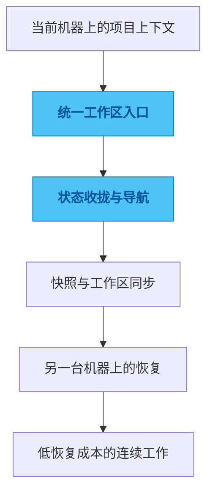

# tmux-sync

## 一句话

一个把 `tmux session`、`git worktree` 和多设备工作区状态串起来的工作台管理器。

## 解决的问题

在多台机器之间切换开发环境时，最容易丢的不是代码，而是上下文：当前在做什么、在哪个分支、哪个窗口、哪个工作区，恢复这些状态本身就很耗注意力。

## 为什么选这个方案方向

常见做法是继续靠 shell 命令、tmux 操作和 worktree 习惯去维持秩序，但这会让恢复成本不断落在用户身上。我没有继续做单点命令增强，而是把工作区状态本身做成管理对象，因为我更在意恢复路径和多设备一致性，而不是命令数量。

## 我关注的效果 / 质量标准

我最关注的是进入工作区的路径足够短、恢复上下文足够快、跨机器体验尽量一致，以及状态变更在长期使用中仍然可理解、可修复。

## 我想展示的工程判断

这个项目最能体现我的一个偏好：很多所谓“效率问题”其实是状态管理问题，只有把状态收拢起来，效率工具才会真正有复利。

## 思路图

## 技术关键词

`tmux` `git worktree` `TUI` `Rust` `Python` `multi-device workflow`
