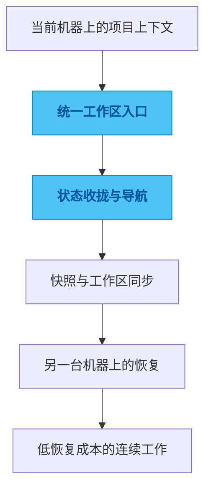

# tmux-sync

## 一句话

一个把 `tmux`、`git worktree` 和多设备工作区状态串起来的工作台管理器。

## 解决的问题

跨机器切换开发环境时，最容易丢的往往不是代码，而是现场。昨天停在哪个分支？哪个窗口还挂着日志？当前这一组终端到底对应哪个任务？这些信息单看都不复杂，但一旦要靠人自己恢复，注意力会被很快耗掉。

很多“效率低”的感受，往下拆其实不是操作慢，而是上下文恢复太贵。代码还在，工作现场却没有被保存下来。

## 为什么选这个方案方向

继续靠 shell 习惯、tmux 命名和 worktree 纪律去维持秩序，当然也能用。但只要机器变多、项目变多、并行现场变多，恢复成本最终还是会全部落回用户身上。

所以我没有继续做单点命令增强，而是把工作区状态本身当成需要被管理的对象。既然真实现场是由目录、分支、会话和窗口共同组成的，那就应该先把这些状态收拢起来，再谈切换速度和操作体验。

## 我关注的效果 / 质量标准

我最在意的是进入工作区的路径要短，恢复上下文的成本要低，跨机器的体验要尽量一致。

一个真正好的结果，不是多几个快捷命令，而是换一台机器以后，用户能很快回到原来的工作现场，而不是重新搭一遍环境和心智。

## 我想展示的工程判断

这个项目最能体现我的一个偏好：很多表面上的效率问题，其实本质上是状态管理问题。

只有把状态收拢到系统里，效率工具才会开始产生复利，而不是继续要求用户记住一切。

## 思路图

## 技术关键词

`tmux` `git worktree` `TUI` `Rust` `Python` `multi-device workflow`
