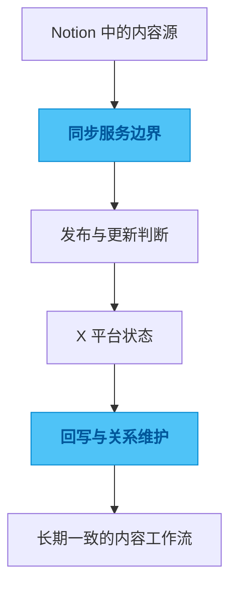

# tweet-database

## 一句话

一个把 Notion 作为内容源头，并与 X 保持双向同步的社交内容服务。

## 解决的问题

如果用 Notion 管理社交内容，真正难的不是“发出去”，而是发布状态、内容更新、多账户路由、回写关系和长期一致性都要被稳定维护。

## 为什么选这个方案方向

常见做法是做一条单向发布链路，能发就够了，但一旦内容被修改、平台状态变化或账号变多，系统就会很快失真。我没有停留在自动发布上，而是做成可追踪的双向同步服务，因为我更在意内容工作流的完整性，而不是单次发布是否省一步。

## 我关注的效果 / 质量标准

我最关注的是状态机清楚、内容来源边界明确、幂等性可靠、多账户之间不串数据，以及在长时间运行后依然可维护。

## 我想展示的工程判断

这个项目体现的是我对内容自动化的一种判断：真正值得做的不是“自动发帖”，而是把内容系统、平台状态和后续维护都放进同一个可控边界里。

## 思路图

## 技术关键词

`TypeScript` `Notion API` `X API` `SQLite` `content workflow` `webhook`
