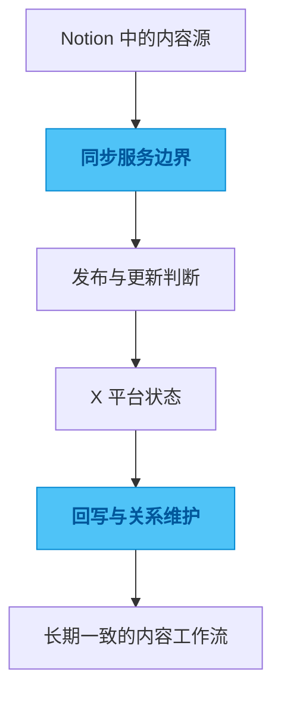

# tweet-database

## 一句话

一个把 Notion 作为内容源头，并与 X 保持双向同步的社交内容服务。

## 解决的问题

如果用 Notion 管理社交内容，真正复杂的并不是“发出去”这一刻，而是发布状态、更新关系、多账户路由、回写结果和长期一致性要不要一起被维护。

只做单次发布看起来很轻，但只要内容会修改、账号会增多、状态会反复变化，系统很快就会开始失真。最后最难回答的问题反而是：现在这条内容到底处于什么状态。

## 为什么选这个方案方向

最省事的做法是做一条单向发布链路，能发就够了。但这种方式只解决了“发送”，没有真正解决“内容生命周期管理”。一旦远端状态变化，或者本地内容需要更新，系统就会开始出现断裂。

所以我没有停留在自动发布上，而是把重点放在双向同步和状态关系维护上。既然内容源头、本地管理和平台状态都会持续变化，那就应该把它们放进同一个可控边界里，而不是假设世界永远不会回写。

## 我关注的效果 / 质量标准

我最看重的是状态机是否清楚，来源边界是否明确，多账户之间会不会串数据，以及长时间运行后还能不能继续维护。

一个好的内容系统，不是帮你少点一次发布按钮，而是让你在几周之后回来看时，依然知道每条内容经历了什么。

## 我想展示的工程判断

这个项目体现的是我对内容自动化的一种判断：真正值得做的不是“自动发帖”，而是把内容系统、平台状态和后续维护放进同一个可控边界里。

内容一旦进入长期运行状态，秩序感比单次效率更重要。

## 思路图

## 技术关键词

`TypeScript` `Notion API` `X API` `SQLite` `content workflow` `webhook`
