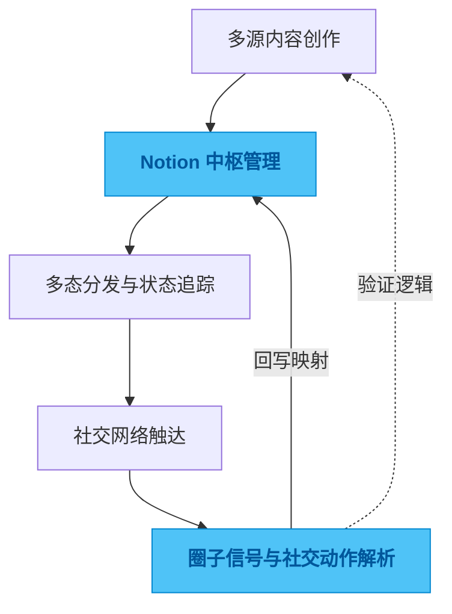

# tweet-database

## 一句话

一个以 Notion 为中枢的内容系统，通过集中管理多源创作并解析社交互动信号，来验证内容流转关系并沉淀圈子动态。

## 解决的问题

如果只把 Notion 当作写作板，发散出去的内容和随之产生的社交互动（转、评、赞）很快就会变成无法追踪的流水。真正的难点不在于“如何把内容发出去”，而在于当内容触达不同圈层后，后续产生的流量反馈和社交动作难以被结构化捕获。

没有闭环的互动追踪，就无法客观验证“内容创作”与“流量流转”之间的因果逻辑，也无法在复杂的社交语境中支撑长期且自然的交互节奏。

## 为什么选这个方案方向

最简单的做法是单向分发外加一个数据看板，但这种做法割裂了“创作源头”和“社交回馈”。

我的判断是：不仅要把多源内容集中收拢到 Notion 维护，更要把外部捕获到的社交动作和圈子信号重新映射回这本“账本”里。既然互动的本质是状态的改变，那么把内容主体、分发路由和互动信号放进同一个可控的系统边界内，才是验证流量关系、复盘传播逻辑的合理路径。

## 我关注的效果 / 质量标准

我最关注系统是否能长期维持高信噪比：跨平台的状态机是否清晰、解析回来的社交信号是否精准挂载到源头、多流向的信息流会不会互相串扰。

一个好的内容网络，不应该只展示冰冷的数字，而是应当在几周后回顾时，能清晰复现某条内容是如何流转的、引发了怎样的圈子共振，并借此调整后续的互动基调。

## 我想展示的工程判断

真正有价值的自动化不仅是“把数据推出去”，更是“把结果拉回来并建立关联”。这个项目体现了我对内容生命周期的理解：通过对模糊、异步的社交互动进行结构化解析，将其降维成 Notion 中确定的数据快照，用工程的秩序感去接管社交网络中非确定性的反馈。

## 思路图

## 技术关键词

`TypeScript` `Notion API` `Social Signal Parsing` `Content Workflow` `Data Synchronization` `State Machine`
